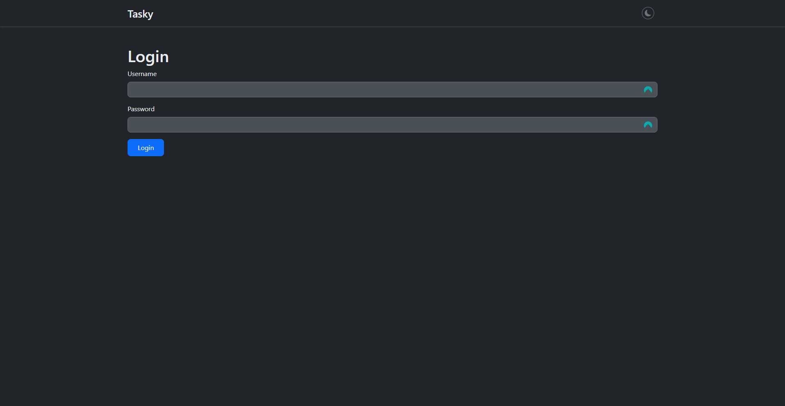
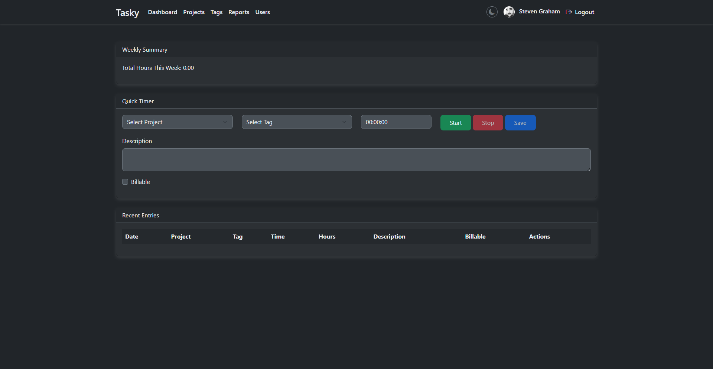
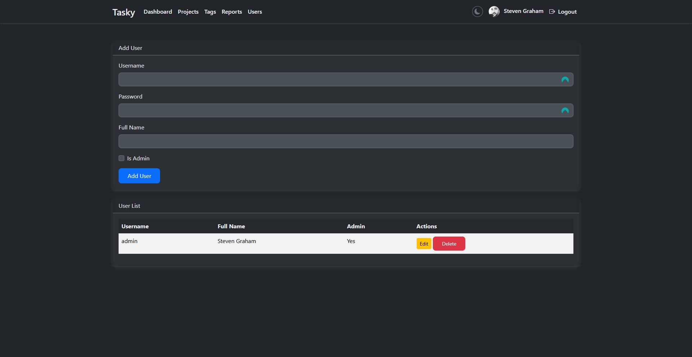
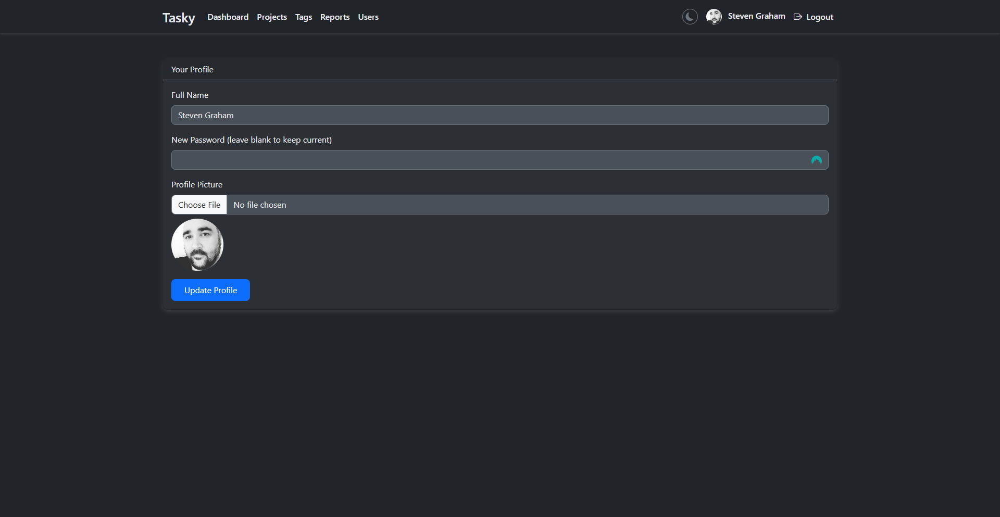
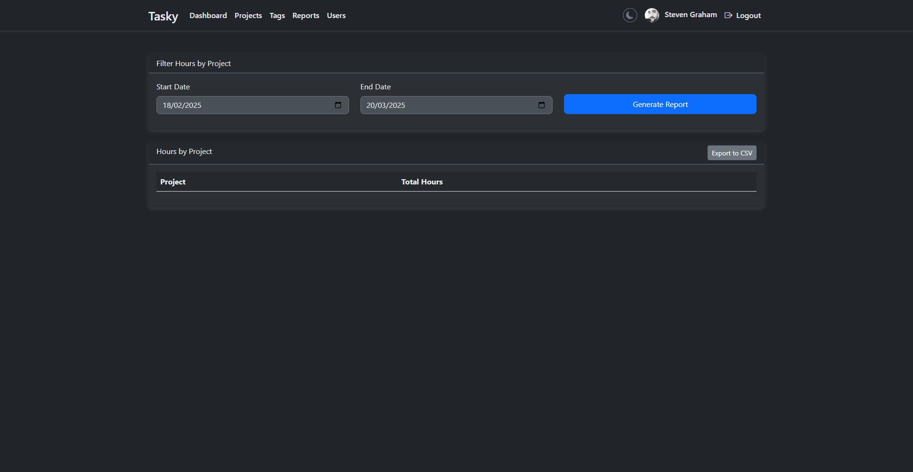

# Tasky - Timesheet Tracker


**Tasky** is a web-based timesheet tracking application built with PHP, MySQL, and Bootstrap 5.3.3, inspired by tools like Clockify. It allows users to track work hours, manage projects, tags, and users, update their profiles, and generate reports, with support for light and dark themes.

## Table of Contents

- [Features](#features)
- [Screenshots](#screenshots)
- [Installation](#installation)
- [Usage](#usage)
- [Project Structure](#project-structure)
- [Contributing](#contributing)
- [License](#license)

## Features

- **User Authentication**: Secure login with CSRF protection.
- **User Management**: Admins can add, edit, and delete users (username, password, full name, admin status).
- **Profile Management**: Users can update their full name, password, and profile picture with cropping support.
- **Time Tracking**: Start/stop timer to log work hours, with manual entry support.
- **Project Management**: Add and list projects with client details.
- **Tag Management**: Categorize entries with custom tags.
- **CRUD Operations**: Create, read, update, and delete timesheet entries.
- **Reporting**: Generate reports of total hours by project with date range filtering.
- **Theme Support**: Toggle between light and dark modes (available on login page and all authenticated pages) with persistent user preference.
- **Responsive Design**: Built with Bootstrap 5.3.3 for a mobile-friendly UI.
- **Error Logging**: Custom error handler logs to `logs/php_errors.log` for debugging.

## Screenshots

### Login Page with Theme Toggle



### Dashboard with Timer



### User Management



### Profile Page with Cropping



### Reports



## Installation

### Prerequisites

- **PHP 7.4+** with PDO MySQL extension
- **MySQL 5.7+**
- **Web Server** (e.g., Apache via XAMPP, WAMP, or MAMP)
- **Composer** (PHP dependency manager)

### Steps

1. **Clone the Repository**:
   ```bash
   git clone https://github.com/itsmestevieg/tasky.git
   cd tasky
   ```
