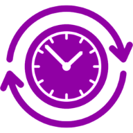

# Tasky - Timesheet Tracker



**Tasky** is a web-based timesheet tracking application built with PHP, MySQL, and Bootstrap 5.3.3, inspired by tools like Clockify. It allows users to track work hours, manage projects, tags, and users, update their profiles, and generate reports, with support for light and dark themes.

## Table of Contents

- [Features](#features)
- [Screenshots](#screenshots)
- [Installation](#installation)
- [Usage](#usage)
- [Project Structure](#project-structure)
- [Contributing](#contributing)
- [License](#license)

## Features

- **User Authentication**: Secure login with CSRF protection.
- **User Management**: Admins can add, edit, and delete users (username, password, full name, admin status).
- **Profile Management**: Users can update their full name, password, and profile picture with cropping support.
- **Time Tracking**: Start/stop timer to log work hours, with manual entry support.
- **Project Management**: Add and list projects with client details.
- **Tag Management**: Categorize entries with custom tags.
- **CRUD Operations**: Create, read, update, and delete timesheet entries.
- **Reporting**: Generate reports of total hours by project with date range filtering.
- **Theme Support**: Toggle between light and dark modes (available on login page and all authenticated pages) with persistent user preference.
- **Responsive Design**: Built with Bootstrap 5.3.3 for a mobile-friendly UI.
- **Error Logging**: Custom error handler logs to `logs/php_errors.log` for debugging.

## Screenshots

### Login Page with Theme Toggle


### Dashboard with Timer


### User Management


### Profile Page with Cropping


### Reports


## Installation

### Prerequisites

- **PHP 7.4+** with PDO MySQL extension
- **MySQL 5.7+**
- **Web Server** (e.g., Apache via <a href="https://www.apachefriends.org/index.html" target="_blank">XAMPP</a>, <a href="https://www.wampserver.com/en/" target="_blank">WAMP</a>, or <a href="https://www.mamp.info/en/" target="_blank">MAMP</a>)
- **Composer** (PHP dependency manager) <a href="https://getcomposer.org/download/" target="_blank">Download</a>

### Steps

1. **Clone the Repository**:

   ```bash
   git clone https://github.com/itsmestevieg/tasky.git
   cd tasky
   ```

2. **Install Dependencies:**

- Run Composer to install Twig:
  ```bash
  composer install
  ```

3. **Set Up the Database:**

- Create a MySQL database named `tasky_db`:
  ```sql
  CREATE DATABASE tasky_db;
  ```
- Import the schema from `database.sql` (create this file with the SQL below):

  ```sql
     USE tasky_db;

  CREATE TABLE users (
      id INT AUTO_INCREMENT PRIMARY KEY,
      username VARCHAR(50) NOT NULL UNIQUE,
      password VARCHAR(255) NOT NULL,
      full_name VARCHAR(100) NOT NULL,
      is_admin BOOLEAN DEFAULT FALSE,
      profile_picture VARCHAR(255) DEFAULT NULL,
      created_at TIMESTAMP DEFAULT CURRENT_TIMESTAMP
  );

  CREATE TABLE projects (
      id INT AUTO_INCREMENT PRIMARY KEY,
      name VARCHAR(100) NOT NULL,
      client VARCHAR(100),
      hourly_rate DECIMAL(10,2),
      created_at TIMESTAMP DEFAULT CURRENT_TIMESTAMP
  );

  CREATE TABLE tags (
      id INT AUTO_INCREMENT PRIMARY KEY,
      name VARCHAR(50) NOT NULL UNIQUE,
      created_at TIMESTAMP DEFAULT CURRENT_TIMESTAMP
  );

  CREATE TABLE timesheet_entries (
      id INT AUTO_INCREMENT PRIMARY KEY,
      user_id INT NOT NULL,
      project_id INT,
      tag_id INT,
      date DATE NOT NULL,
      start_time TIME,
      end_time TIME,
      hours_worked DECIMAL(5,2),
      description TEXT,
      is_billable BOOLEAN DEFAULT FALSE,
      created_at TIMESTAMP DEFAULT CURRENT_TIMESTAMP,
      FOREIGN KEY (user_id) REFERENCES users(id),
      FOREIGN KEY (project_id) REFERENCES projects(id),
      FOREIGN KEY (tag_id) REFERENCES tags(id)
  );

  -- Add a default admin user (password: passsword)
  INSERT INTO users (username, password, full_name, is_admin) VALUES (
      'admin',
      '$2y$10$uwzggjkjhx8uSrXfXTAdOOC3hPI6PZSh1EcGE3v.66ATqdEyYNhcC',
      'Admin User',
      TRUE
  );
  ```

4. **Configure Database Connection:**

- Update `config.php` with your MySQL credentials:
  ```php
  <?php
  try {
     $pdo = new PDO("mysql:host=localhost;dbname=tasky_db", "root", "");
     $pdo->setAttribute(PDO::ATTR_ERRMODE, PDO::ERRMODE_EXCEPTION);
  } catch (PDOException $e) {
     die("Connection failed: " . $e->getMessage());
  }
  ```

5. **Set Up File Permissions:**

- Ensure the `logs/` and `uploads/` directories exist and are writable:
  ```bash
  mkdir logs uploads
  chmod 777 logs uploads
  ```
- On Windows, ensure the directories are writable by the web server user (e.g., via File Explorer > Properties > Security).

6. Run the Application:

- Place the project in your web server’s root directory (e.g., `C:\xampp\htdocs\tasky`).
- Start your web server and MySQL (e.g., via XAMPP).
- Access the app at `http://localhost/tasky/index.php`.

## Usage

1.  **Log in:**

- Use the default admin credentials:
  - Username: `admin`
  - Password: `passsword`

2. **Toggle Theme:**

- Use the theme toggle button (sun/moon icon) in the navbar to switch between light and dark modes, available even on the login page.

3.  **Track Time:**

- On the dashboard, select a project, start the timer, and save your entry.
- Add a description, tag, and mark as billable if needed.

4. **Manage Projects and Tags:**

- Navigate to "Projects" to add new projects.
- Navigate to "Tags" to add custom tags for categorizing entries.

5. **Edit/Delete Entries:**

- From the dashboard, click "Edit" or "Delete" on any timesheet entry.

6. **Manage Users (Admins Only):**

- Go to "Users" to add, edit, or delete users.
- Set admin status for users as needed.

7. **Update Profile:**

- Click your name in the navbar to go to your profile.
- Update your full name, password, and profile picture (with cropping support).

8. **Generate Reports:**

- Go to "Reports" to view total hours by project within a date range.

## Project Structure

```text
tasky/
├── app/
│   ├── Auth.php
│   ├── Project.php
│   ├── Tag.php
│   ├── Timesheet.php
│   ├── Report.php
│   └── User.php
├── logs/
│   └── php_errors.log
├── uploads/
├── templates/
│   ├── pages/
│   │   ├── login.twig
│   │   ├── dashboard.twig
│   │   ├── projects.twig
│   │   ├── tags.twig
│   │   ├── edit_entry.twig
│   │   ├── reports.twig
│   │   ├── users.twig
│   │   ├── edit_user.twig
│   │   └── profile.twig
│   ├── partials/
│   │   └── headscripts.twig
│   └── base.twig
├── vendor/
├── composer.json
├── composer.lock
├── config.php
└── index.php
```

## Contributing

Contributions are welcome! To contribute:

1. Fork the repository.
2. Create a new branch (`git checkout -b feature/your-feature`).
3. Make your changes and commit (`git commit -m "Add your feature"`).
4. Push to your branch (`git push origin feature/your-feature`).
5. Open a Pull Request.

Please ensure your code follows PSR-4 standards and includes appropriate tests.

## License

This project is licensed under the MIT License. See the [LICENSE](LICENSE.MD) file for details.
